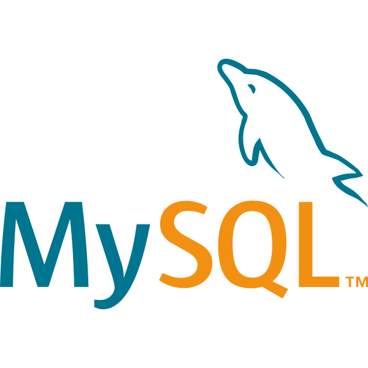
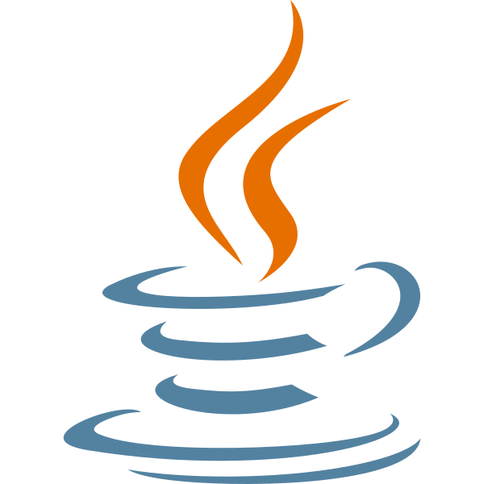
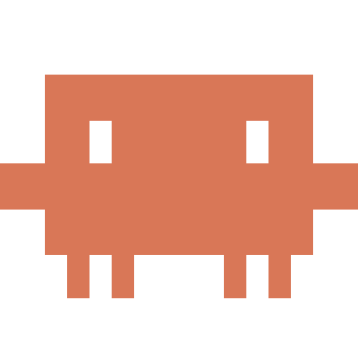

# Hi there 👋

A software developer who enjoys working across the stack — from building clean, responsive interfaces to designing solid backend systems, with a growing focus on AI-powered applications. Below is a quick snapshot of the tools and technologies I work with, and what I am currently working on.

### A bit about myself:
```yaml
about_me:
  author: Abhishek Majumdar
  role: Software Developer
  location: Victoria, BC
  languages: [Python, JavaScript, Java]

  system:
    os: macOS Tahoe 26.5.1
    shell: bash, zsh
    editors: Visual Studio Code, IntelliJ
    LLM tools: Claude code, Microsoft Copilot, ChatGPT

  stack:
    frontend: [React, Next.js, Tailwind CSS]
    backend: [Node.js/express, NestJS,  FastAPI, Django]
    data-science: [Numpy, Pandas, R, Matlab]
    database: [SQLite, PostgreSQL, Redis]
    devops: [Docker, GitLab CI/CD, GitHub Actions]

  dependencies:
    - good music
    - espresso

  training:
    education: Bachelors in Software Engineering, University of Victoria
    currently_learning: AI integration using LLM API's, machine learning (supervised, unsupervised learning), Kubernetes orchestration. 

  deployment:
    platforms: [Vercel, Firebase, AWS]
    status: actively_shipping

  contact:
    email: mabhishek1705@gmail.com

  fun_fact: I am a little judgemental towards a new city I visit based on how good the food is 🍲🥪
```

### Technologies & tools

> 
> 
> 
>        
> 
> 
> 
> 
> 
> 
> 
> 
> 
> 
> 
> 
> 


### I am currently working on
> Doing my first open-source contribution at [**Jabref**](https://github.com/JabRef/jabref) Bibliography manager
<br>


<!--
**ABhiShek1705m/ABhiShek1705m** is a ✨ _special_ ✨ repository because its `README.md` (this file) appears on your GitHub profile.

Here are some ideas to get you started:

- 🔭 I’m currently working on ...
- 🌱 I’m currently learning ...
- 👯 I’m looking to collaborate on ...
- 🤔 I’m looking for help with ...
- 💬 Ask me about ...
- 📫 How to reach me: ...
- 😄 Pronouns: ...
- ⚡ Fun fact: ...
-->
